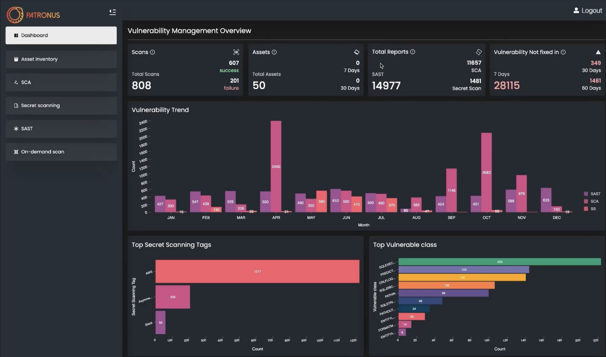

# Patronus

Patronus is a fully dockerised and comprehensive config driven Security Framework which helps to detect security vulnerabilities in the Software Development Life Cycle of any application. The framework inculcates a highly automated approach for vulnerability identification and management. With Patronus’s fully whitebox approach, the framework currently covers four major verticals; Secrets Scanning, Software Composition Analysis, Static Application Security Testing and Asset Inventory and can be used extensively for languages like Java, GoLang, Javascript.

The framework focuses on the needs of the security engineers and the developers alike with a dedicated actionable web dashboard to abstract all the nitty gritty technicalities of the security vulnerabilities detected and also empowers the user with higher level of vulnerability tracking for better patch management with more actionable approach to solving security. The dashboard is built completely with analytics, functionality and maintaining ease in mind to demonstrate and display various metrics for the scans and vulnerabilities. It also helps to search, analyse and resolve vulnerabilities on-the-go and provides a completely consolidated vulnerability report. 

Patronus hugely reduces the time and efforts of the security team in thoroughly reviewing any application from a security lens. The framework comes with an on-demand scanning feature apart from the scheduled daily automated scans, using which developers and security engineers can scan particular branches and repositories at any point of time in the SDLC, directly from the dashboard or integrations like Slack. The framework is completely adaptable and various softwares like Slack and Jira can be easily integrated directly with Patronus for better accessibility and tracking since most organisations today use these extensively.

## High Level Diagrams

## Dashboard

##  Key Pillars of the Framework

* #### Static Analysis
	* Java
	* Golang
	* JavaScript

* #### Software Compostion Analysis
	* Java
	* JavaScript

* #### Secrets Scanning
* #### Asset Inventory

## Additional Features

* On-demand Scanning ✅
* SSO Support ✅
* Actionable Dashboard ✅
* REST Api Support ✅
* Support for Custom Integrations like Slack, Jira ✅
* Pre-scheduled Scans ✅

## Prerequisite

* Git
* Docker
* docker-compose

## Installation
https://patronus.readthedocs.io/en/latest/Installation.html#id1

### Team:
* [Akhil Mahendra](https://twitter.com/Akhil_Mahendra)
* [Akshansh Jaiswal](https://twitter.com/Akshanshjaiswl)
* [Ashwin Shenoi](https://twitter.com/__c3rb3ru5__)
 
### Project Contributors:
* [Himanshu Kumar Das](https://twitter.com/mehimansu)
* [Anirudh Anand](https://twitter.com/a0xnirudh)
* [Abhishek J M](https://twitter.com/HawkSpawn)
* [Rashid feroz](https://twitter.com/rashid_feroz)

## Credits:
* [FindSecBugs](https://github.com/find-sec-bugs/find-sec-bugs)
* [Gosec](https://github.com/securego/gosec)
* [Npm audit]()
* [Dependency-Check](https://github.com/jeremylong/DependencyCheck)
* [Gitleaks](https://github.com/zricethezav/gitleaks)
* [Linguist](https://github.com/github/linguist)
* [Exploit-db](https://www.exploit-db.com/)
* [Sploitus](https://sploitus.com/)
